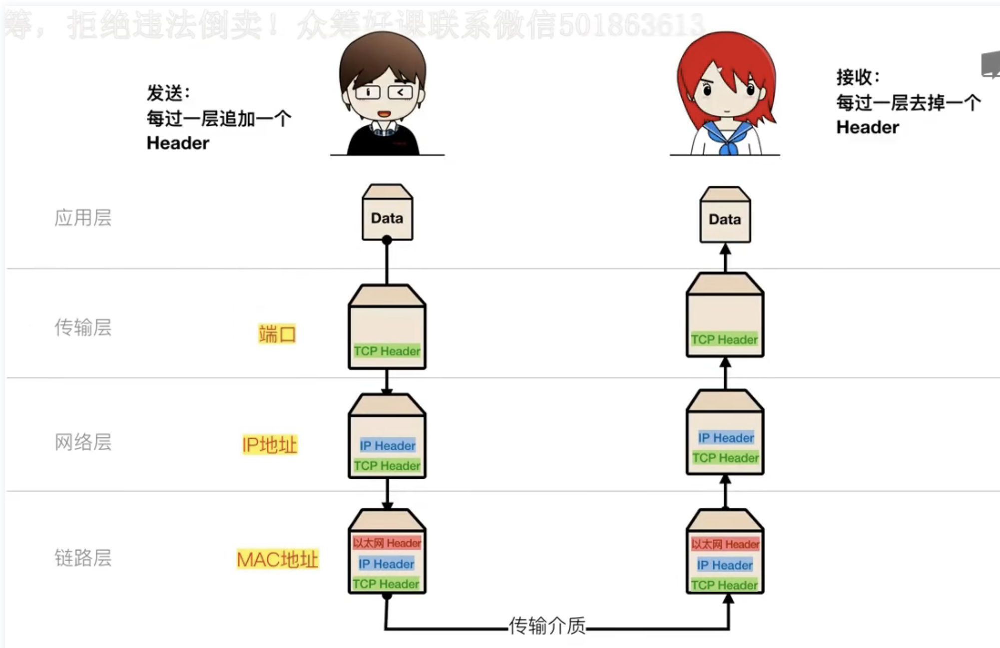
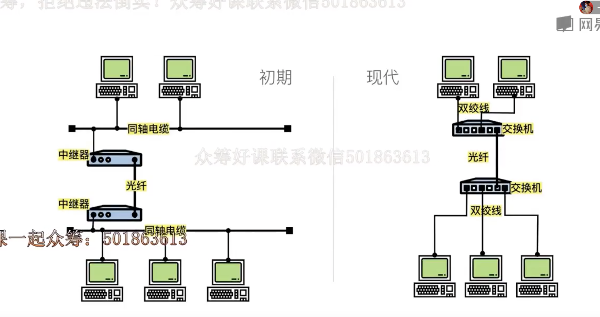
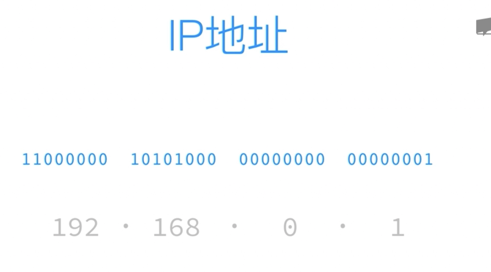
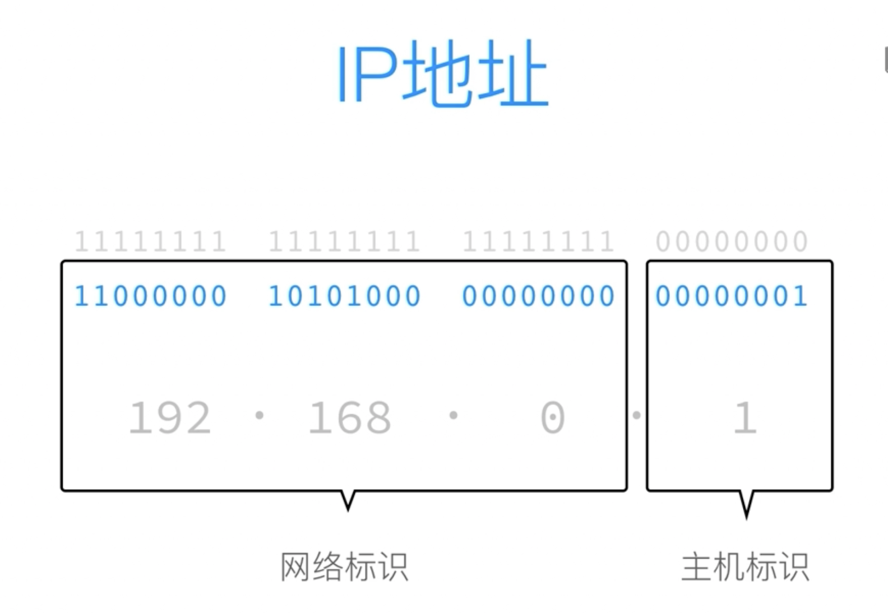
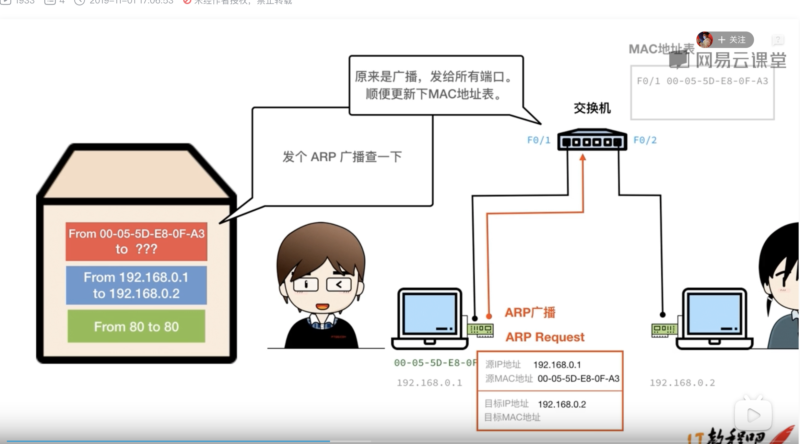
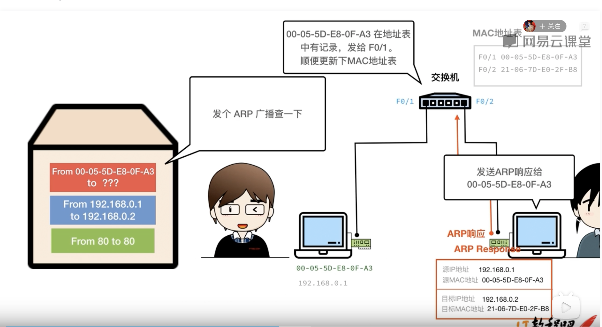
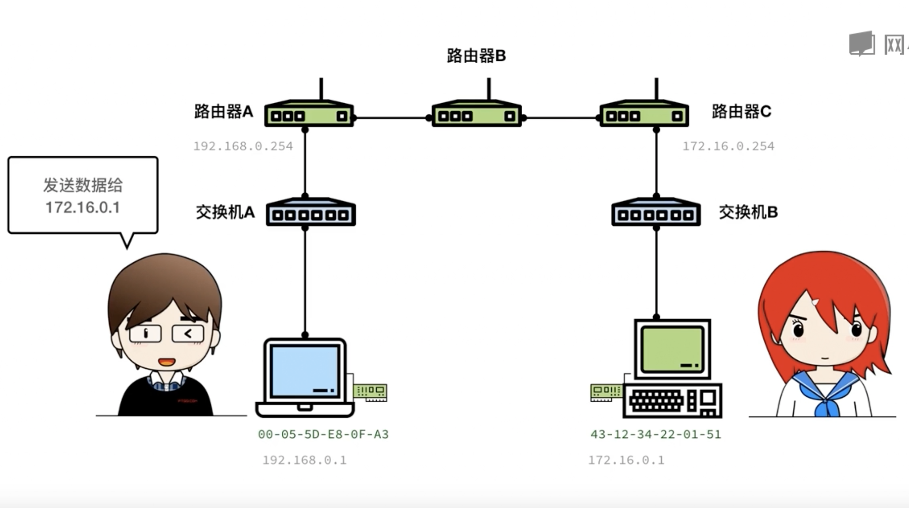
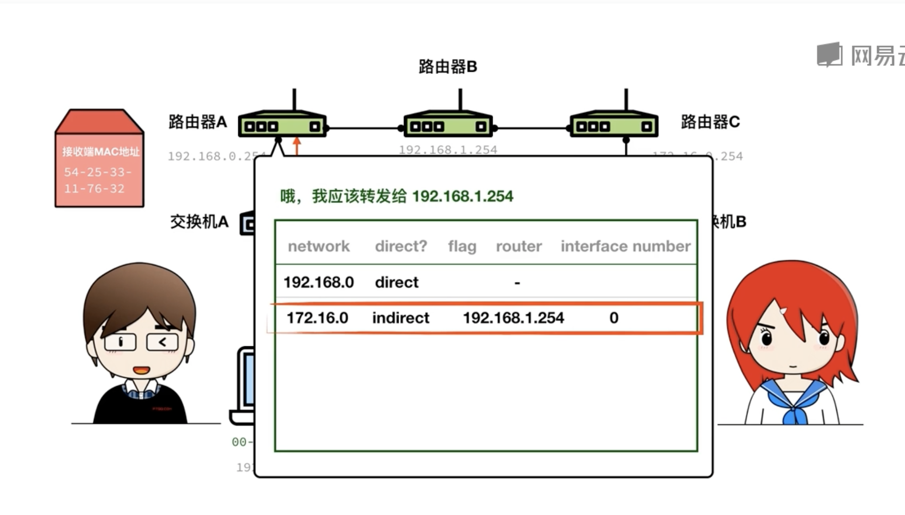

网络数据传输方式
一层一层的打包 然后一层一层的解析

1. 发送者的数据从应用层到传输层 会增加TCP Header (端口)
2. 然后到网络层 会增加IP header (IP地址)
3. 然后到链路层 会增加以太网 Header (MAC地址) 通过传输介质到接收者 
4. 以太网发现有个 以太网的Header 就把这个包给对应的MAC地址
5. 然后传到网络层 IP协议解析这个包 找到对应的IP地址 发送过去
6. 然后传到传输层 解析到端口  传给对应端口的应用

# 以太网

## 网卡和MAC地址
MAC地址： 00-05-5D-E8-0F-A3
交换机就是根据MAC地址转发数据的
1. 电脑通过网卡连接网络
2. 每块网卡有个厂商设定的MAC地址（又称物理地址）
3. 这个地址是设备的唯一标识
4. 网卡的MAC地址可以通过驱动改变（只要在同一个链路里面没有相同的话不会有影响）

## 以太网的Header
1. 目标MAC地址（6字节）
2. 源MAC地址（6字节）
3. 类型 （2字节）
4. 数据（46~1500字节）
5. FCS（4字节，帧检验序列）

# IP协议

## IP地址

1. 又32位二进制数组成
2. 分为*网络标识*和*主机标识*两部分
3. *子网掩码*确定了32位里面哪些是主机标识哪些是网络标识
   1为网络标识，0为主机标识

## 路由控制
### 在同一个网络下的数据传输：

1. 应用层192.168.0.1 给 192.168.0.1 发送信息
2. 传输层 增加TCP Header 记录端口： from 80 to 80 
3. 网络层 增加IP Header 记录ip: from 192.168.0.1 to 192.168.0.2
4. 以太网 增加以太网 Header from 00-05-5D-E8-A3 to ??? 
   这个时候以太网知道发送者的MAC地址，同时在MAC地址表记录下来，但是不知道接收者192.168.0.2 的MAC地址
5. 这时候会发一个ARP广播 对应的信息有发送者的ip和MAC地址接收者的IP地址和**MAC（FFFFFF）** 
6. 交换机收到目标MAC地址为FFFFFF 会发送一个广播给连接交换机的所有电脑 查询对目标IP对应电脑MAC地址
7. 当目标电脑收到信息以后会将MAC地址告诉发送者，同时也会经过交换机，交换机会在MAC地址表记录下来
8. 知道目标的MAC地址以后就可以将MAC地址补到之前缺失的MAC地址上
9. 最后一层层解析数据就到了192.168.0.2的电脑上

### 网络之间的数据传输

1. 将出数据从192.168.0.1 发送给 172.6.0.1 因为ip不是在同一个网段所以会发送给网关（192.168.0.254）
2. 但是不知道网关的MAC地址，所以会发起ARP查询
3. 然后收到网关的ARP响应，将MAC地址补上并且把数据发送给网关192.168.0.254）
4. 网关收到192.168.0.1发来的数据，发现目标的IP地址也不是自己，然后查询路由表得知自己应该发送给路由器B 也就是192.168.1.254
5. 然后再次发起ARP查询 找到192.168.1.254 MAC地址 并发送给过去
6. 直到发送到路由器C，路由器C查询他自己的路由表发现，这个网段是自己直连的，然后查询ARP缓存里面有没有IP对应的MAC地址，只要172.6.0.1往外面发过数据，那么他的MAC地址就会被缓存下来，如果没有发送过那就发起ARP广播查询172.6.0.1MAC地址，拿到地址以后将目标的MAC地址更改为172.6.0.1MAC地址，将数据发送过去。
7. 经过网络层和传输层172.6.0.1拿到最终数据

# IP分片和重组
1. 不同的网络上最大传输单元（MTU）的大小是不一样的
2. IP协议这是网络的上层封装，它对此进行了抽象
3. 路径发现MTU会在发送数据帧超过网络MTU时自动调整并重发数据
4. IP报文由路由器进行分片，目标主机进行重组
